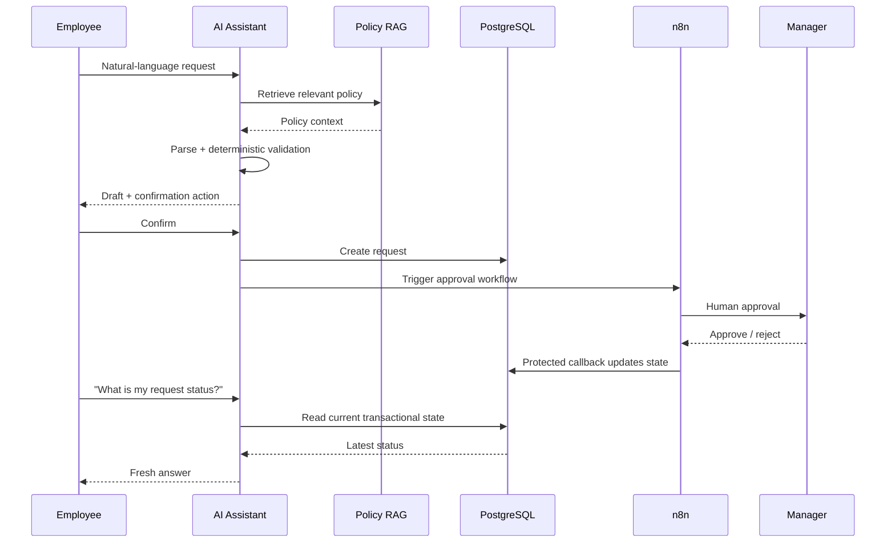

# People Assistant — ElevateHR AI HR Copilot

> An agentic HR assistant that turns natural-language employee requests into policy-grounded, auditable workflows with human approval.

**Live demo:** https://hr-assistant-web.vercel.app

## Why this project exists

Most HR assistants stop at answering FAQs. People Assistant goes further: it combines **LLM reasoning, RAG, transactional data, deterministic validation, signed confirmations, and human-in-the-loop automation** so an employee can ask a question, prepare a request, approve the draft, and track the real workflow state from one conversational interface.

The project is designed as a portfolio-grade demonstration of **AI Engineering, AI Agents, RAG, workflow automation, and full-stack AI product development**.

---

## What it can do

### Policy-aware AI chat

- Answers HR policy questions using a company handbook through RAG.
- Uses Gemini embeddings with pgvector-backed semantic retrieval.
- Keeps policy knowledge separate from transactional employee data.
- Returns grounded answers instead of treating chat history as the source of truth.

### Employee-aware context

- Uses a server-scoped employee context for the portfolio demo.
- Reads employee profile data from PostgreSQL.
- Keeps request ownership on the server instead of trusting an `employeeId` supplied by the browser.

### Leave workflow

- Checks leave balance.
- Parses natural-language leave dates.
- Validates leave policy.
- Creates a draft before any database mutation.
- Requires explicit confirmation before submission.
- Sends manager approval through n8n.
- Reads fresh transactional status from the database.

### Overtime workflow

- Parses natural-language overtime requests.
- Validates duration and policy requirements.
- Supports second approval when required by policy.
- Handles `24:00` as end-of-day / next-day midnight in the production flow.
- Tracks manager decision, second approver decision, and workflow completion.

### Reimbursement workflow

- Parses expense claims from natural language.
- Validates claim policy before submission.
- Uses explicit confirmation before creating the request.
- Sends manager approval through n8n.
- Tracks approval and workflow status from transactional data.

### Workflow automation

The application triggers n8n workflows for Leave, Overtime, and Reimbursement. n8n handles human approval steps and calls protected application callbacks to update transactional state.

---

## Architecture

```mermaid
flowchart LR
    U[Employee] --> UI[Next.js UI]
    UI --> CHAT[/api/chat]

    CHAT --> LLM[Gemini]
    CHAT --> TOOLS[Agent Tools]

    TOOLS --> RAG[RAG Retrieval]
    RAG --> EMB[Gemini Embeddings]
    EMB --> PGV[(Supabase PostgreSQL + pgvector)]

    TOOLS --> DB[(Transactional PostgreSQL)]
    TOOLS --> POLICY[Deterministic Policy Validation]
    TOOLS --> TOKEN[Signed Confirmation Token]

    TOKEN --> CONFIRM[Confirm API]
    CONFIRM --> DB
    CONFIRM --> N8N[n8n Workflows]

    N8N --> HUMAN[Manager / Second Approver]
    HUMAN --> N8N
    N8N --> CALLBACK[Protected Callback APIs]
    CALLBACK --> DB

    DB --> STATUS[Fresh Transactional Status Tools]
    STATUS --> CHAT
    CHAT --> UI
```

### Request lifecycle



---

## AI engineering design

### 1. RAG for knowledge, database tools for transactions

The assistant deliberately separates two kinds of truth:

- **Policies and procedures** → RAG over the HR handbook.
- **Employee/request state** → live PostgreSQL queries.

This prevents stale chat history or retrieved documents from overriding current transactional state.

### 2. Draft-first actions

The LLM does not directly create high-impact HR requests as soon as it recognizes intent.

Instead:

1. Parse the request.
2. Retrieve policy context.
3. Run deterministic validation.
4. Return a draft.
5. Require explicit user confirmation.
6. Create the database record.
7. Trigger workflow automation.

### 3. Human-in-the-loop approvals

LLM reasoning does not replace manager approval. n8n orchestrates the human approval flow and updates the application through protected callback endpoints.

### 4. Transactional freshness guard

Status questions re-read the current database state. Previous assistant messages are not accepted as authoritative request status.

### 5. Server-side identity boundary

For the portfolio demo, employee identity is resolved from a server environment context. Browser-supplied employee IDs do not determine request ownership.

---

## Tech stack

| Layer | Technology |
|---|---|
| Frontend | Next.js, React, TypeScript |
| AI orchestration | LangChain |
| LLM | Google Gemini |
| Embeddings | Gemini Embedding |
| Vector search | pgvector |
| Database | Supabase PostgreSQL |
| ORM | Prisma |
| Workflow automation | n8n |
| Deployment | Vercel |
| Styling / UI | Tailwind CSS, Lucide React |

---

## Production regression

The deployed portfolio environment has been exercised with a full regression covering:

- Public UI routes
- Employee identity
- Chat sessions
- Leave API and balance
- Overtime ownership hardening
- Reimbursement API
- Completed n8n workflows
- Gemini chat
- RAG retrieval
- Employee-aware AI answers
- Leave transactional freshness
- Overtime transactional freshness
- Reimbursement transactional freshness
- Overtime `19:00 → 24:00` edge case

Latest full-production regression:

```text
PASS: 71
WARN: 1
FAIL: 0

9F FULL PRODUCTION REGRESSION = PASS
```

The single warning is a verifier observability limitation: the reimbursement list response does not expose `employeeId`, so that specific ownership assertion cannot be made from the serialized response alone.

---

## Example demo flows

### Ask a policy question

```text
Berapa jatah cuti tahunan berdasarkan kebijakan perusahaan?
```

The assistant retrieves the relevant HR handbook context and answers using policy-backed information.

### Create a leave request

```text
Saya mau cuti tanggal 5-7 September.
```

The assistant parses the dates, checks balance and policy, presents a draft, and waits for confirmation before submission.

### Create an overtime request

```text
Saya mau lembur tanggal 8 September dari jam 19:00 sampai 24:00
untuk final deployment.
```

The assistant prepares a five-hour draft and determines whether second approval is required.

### Check a real request

```text
Cek status reimbursement saya.
```

The assistant queries current transactional data rather than trusting an old status from conversation history.

---

## Security-oriented design

The portfolio implementation includes several safeguards:

- Server-side request ownership context.
- Explicit confirmation before business-state mutation.
- Signed action tokens for confirmation flows.
- Shared-secret protection for automation callbacks.
- Timing-safe secret comparison on callback authentication.
- Environment secrets excluded from Git.
- Request status tools scoped to the active employee context.
- Unknown request IDs do not reveal another employee's transactional data.

> This repository is a portfolio/demo HR system, not a replacement for production identity, authorization, payroll, or legal-compliance infrastructure.

---

## Local setup

### Requirements

- Node.js
- PostgreSQL / Supabase project
- pgvector
- Gemini API access
- n8n instance

### Install

```bash
npm install
```

### Environment

Create a local `.env` with the required values.

```env
DATABASE_URL=
DIRECT_URL=

GOOGLE_API_KEY=

DEMO_EMPLOYEE_ID=
DEMO_SECOND_APPROVER_ID=

APP_BASE_URL=

N8N_SHARED_SECRET=
N8N_OVERTIME_WEBHOOK_URL=
N8N_LEAVE_WEBHOOK_URL=
N8N_REIMBURSEMENT_WEBHOOK_URL=

OVERTIME_ACTION_SECRET=
LEAVE_ACTION_SECRET=
REIMBURSEMENT_ACTION_SECRET=
```

Never commit real environment values.

### Database

Generate the Prisma client / apply the project schema according to the repository's Prisma setup.

For the hosted Supabase demo, schema synchronization is performed deliberately and destructive database reset commands are avoided.

### Run

```bash
npm run dev
```

Then open:

```text
http://localhost:3000
```

---

## Project structure

```text
app/
  api/
    chat/
    me/
    leave/
    overtime/
    reimbursement/
    sessions/
  components/
  leave/
  reimbursement/

lib/
  ai/
  automation/
  db/

prisma/
  schema.prisma
```

The exact internal structure may evolve, but the main separation is:

- `app/api` → product/API boundaries
- `lib/ai` → agent tools, parsing, RAG, policy logic
- `lib/automation` → n8n integration
- `lib/db` / Prisma → transactional persistence

---

## Scope and known limitations

This is intentionally a portfolio implementation.

- Demo identity currently uses a server-side employee context rather than a complete authentication provider.
- Leave working-day calculation uses the application's configured business-day logic; a complete national-holiday calendar is outside the current scope.
- Production HRIS integrations, SSO/RBAC, payroll integration, and enterprise audit retention would be separate production concerns.

---

## What this project demonstrates

This project is intended to demonstrate practical skills relevant to:

- AI Engineer
- AI Automation Engineer
- AI Agent Developer
- Full-Stack AI Engineer

It focuses on the part that is often missing from simple chatbot projects: **connecting an LLM to real business state and human workflows without allowing the model to become the source of truth or bypass approval boundaries.**

---

## Deployment

Portfolio deployment:

**https://hr-assistant-web.vercel.app**

---

## License

Portfolio / educational project. Add a formal license before reuse or redistribution if required.
