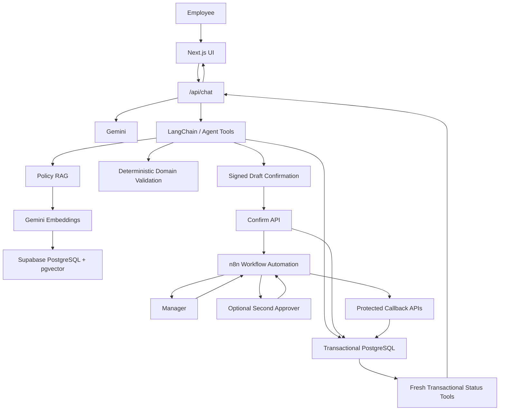
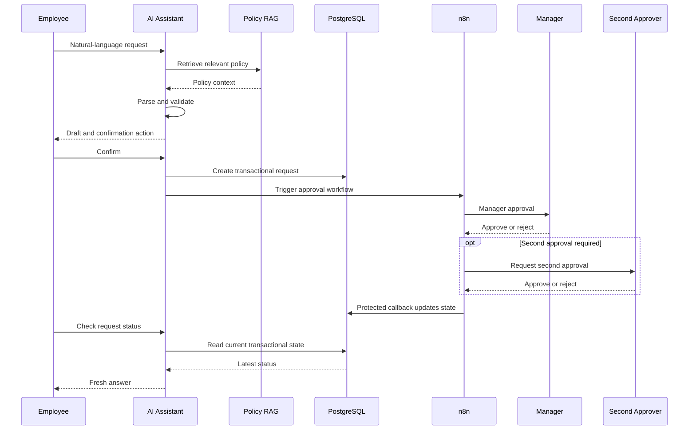

# People Assistant — Architecture Notes

## Core design principle

People Assistant separates **knowledge**, **reasoning**, **business validation**, **transactional state**, and **human approval**.

The LLM acts as an orchestrator and natural-language interface. It is not the final authority for request ownership, current request state, or approval decisions.

The application deliberately separates:

- policy knowledge from transactional data,
- probabilistic AI interpretation from deterministic validation,
- draft preparation from business-state mutation,
- AI assistance from human approval.

---

## System layers

### UI

Next.js provides the conversational interface and HR dashboards.

The UI includes:

- AI Chat
- Dashboard
- Knowledge Hub
- Employee Directory
- Time & Leave
- Expenses & Claims

The browser does not decide which employee owns a transactional request.

---

### AI orchestration

The `/api/chat` route coordinates the assistant workflow.

It:

- resolves the active employee context,
- routes user intent,
- invokes Gemini,
- executes domain tools,
- retrieves policy context through RAG,
- prepares structured action drafts,
- performs policy-aware validation,
- and returns confirmation metadata to the client.

LangChain is used as part of the AI orchestration and tool integration layer.

---

### Knowledge layer

HR policy documents are chunked, embedded, and stored in PostgreSQL with pgvector.

Gemini embeddings are used to represent document chunks for semantic retrieval.

Policy questions and policy-dependent request validation retrieve relevant handbook context through RAG.

The knowledge layer is used for information such as:

- leave policy,
- overtime rules,
- reimbursement policy,
- approval requirements,
- company procedures.

Policy documents are not used as the source of truth for current transactional request status.

---

### Transaction layer

Transactional state is stored in Supabase PostgreSQL and accessed through Prisma.

This includes:

- employees,
- chat sessions,
- leave requests,
- leave balances,
- overtime requests,
- reimbursement requests,
- approval decisions,
- workflow state,
- and audit information.

Transactional status tools re-query PostgreSQL whenever the employee asks for current request status.

This makes the database, rather than conversation history, the source of truth for live business state.

---

### Deterministic validation layer

Natural-language interpretation is handled by the AI layer, but important business rules are validated by application logic.

Examples include:

- required request fields,
- date and time validation,
- overtime duration,
- leave balance,
- policy eligibility,
- second-approval requirements,
- and ownership constraints.

This prevents the LLM from being the sole decision-maker for business rules.

---

### Confirmation boundary

A draft is not a submitted request.

The assistant first prepares a structured draft and presents it to the employee.

High-impact actions require explicit confirmation before the application creates the transactional record.

Signed action tokens protect confirmation flows for:

- Leave
- Overtime
- Reimbursement

The lifecycle is:

```text
natural-language request
        ↓
AI parsing
        ↓
policy retrieval
        ↓
deterministic validation
        ↓
draft
        ↓
explicit user confirmation
        ↓
database mutation
```

---

### Workflow automation layer

n8n orchestrates the human approval workflows.

The application currently uses workflows for:

- Leave Approval
- Overtime Approval
- Reimbursement Approval

Depending on the request, n8n can handle:

- manager approval,
- optional second approval,
- decision callbacks,
- workflow-status callbacks,
- and employee notification.

Callbacks are authenticated before they are allowed to mutate transactional state.

---

## Architecture diagram



---

## Request lifecycle



---

## Why transactional freshness matters

An LLM conversation can contain an old status such as:

```text
Request X is PENDING.
```

If a manager later approves that request, the previous assistant message becomes stale.

For transactional status intents, the application re-reads PostgreSQL and treats the database as the source of truth.

Conceptually:

```text
Chat history
"PENDING"
    ✕
    │
    │ not authoritative
    ↓

PostgreSQL
"APPROVED"
    ↓
current answer
```

This prevents stale conversation history from overriding current workflow state.

---

## Why server-side identity matters

The browser is not trusted to decide which employee owns a request.

In the current portfolio demo, active employee identity is resolved from server configuration through `DEMO_EMPLOYEE_ID`.

Transactional APIs use that server-side context when querying or creating employee-owned records.

For example, supplying another `employeeId` from the browser must not change the active employee scope.

A production enterprise implementation would replace the demo identity mechanism with authentication such as SSO or OIDC while preserving the same server-side authorization boundary.

---

## Human-in-the-loop principle

Policy validation and LLM reasoning can determine whether a request is eligible to enter a workflow, but they do not replace required human approval.

The intended boundary is:

```text
AI understands the request
        ↓
AI retrieves policy
        ↓
application validates rules
        ↓
employee confirms
        ↓
system creates transaction
        ↓
human approver decides
        ↓
database stores final state
```

The AI assists with understanding and orchestration.

The employee authorizes submission.

The manager or second approver makes the business approval decision.

The database remains the source of truth.

---

## Security boundaries

The current portfolio architecture includes several safeguards:

- server-side employee context,
- request ownership scoping,
- explicit confirmation before mutation,
- signed confirmation tokens,
- protected n8n callbacks,
- timing-safe secret comparison,
- transactional freshness checks,
- environment secrets excluded from Git,
- and non-disclosure of foreign request data.

These controls demonstrate the intended application boundaries, but the current project remains a portfolio / production-like implementation rather than a complete enterprise IAM or HRIS security platform.

---

## Current deployment

```text
Employee
   ↓
Next.js / Vercel
   ↓
Gemini + LangChain tools
   ↓
Supabase PostgreSQL + pgvector
   ↓
n8n approval workflows
   ↓
Protected callbacks
   ↓
Transactional state
```

The portfolio deployment has also passed the full production regression suite with:

```text
71 PASS
1 WARN
0 FAIL
```

The remaining warning relates to verifier observability for reimbursement ownership because the list API intentionally does not expose `employeeId`.