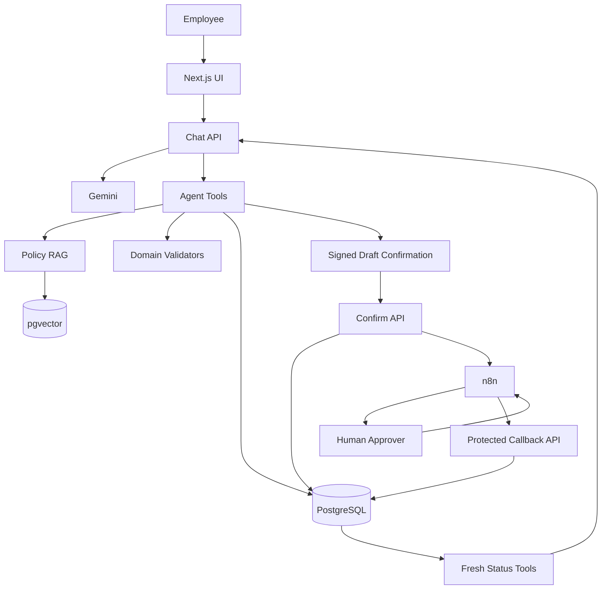

# People Assistant — Architecture Notes

## Core design principle

People Assistant separates **knowledge**, **reasoning**, **business validation**, **transactional state**, and **human approval**.

The LLM is an orchestrator and language interface. It is not the final authority for request ownership, current request state, or approval decisions.

## System layers

### UI

Next.js provides the conversational interface and HR dashboards.

### AI orchestration

The chat API:

- resolves employee context,
- routes user intent,
- invokes Gemini,
- calls domain tools,
- retrieves policy context,
- prepares action drafts,
- and returns confirmation metadata to the client.

### Knowledge layer

HR policy documents are chunked, embedded, and stored in pgvector.

Policy questions and policy-dependent request validation can retrieve relevant context semantically.

### Transaction layer

Leave, overtime, reimbursement, employee, session, workflow, and audit state live in PostgreSQL and are accessed through Prisma.

Transactional status tools re-query this database whenever the user asks for current state.

### Confirmation boundary

A draft is not a submitted request.

High-impact actions require explicit confirmation through signed action metadata before the request is persisted and the automation workflow is triggered.

### Workflow layer

n8n handles approval orchestration:

- manager approval,
- optional second approval,
- employee notification,
- workflow-status callbacks.

Callbacks are authenticated before they may mutate request state.

## Architecture diagram



## Why transactional freshness matters

An LLM conversation can contain old status such as:

```text
Request X is PENDING.
```

After the manager approves the request, that message is stale.

For status intents, the application re-reads PostgreSQL and treats the database as the source of truth. This prevents an old assistant message from winning over the current workflow state.

## Why server-side identity matters

The browser is not trusted to decide which employee owns a request.

In demo mode, the active employee identity comes from server configuration. Request APIs use that server context when querying or creating transactional records.

A production version would replace demo identity with a real authentication/session layer while preserving the same ownership boundary.

## Human-in-the-loop principle

Policy validation and LLM reasoning can determine whether an action is eligible to enter the workflow, but they do not substitute for required human approval.

That distinction is intentional:

```text
AI prepares and validates
        ↓
user explicitly confirms
        ↓
system creates transaction
        ↓
human approver decides
        ↓
database becomes the source of truth
```
